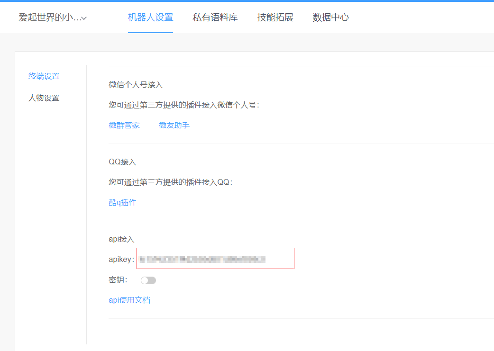

# :robot:wechat_tuling:robot:
使用图灵机器人创建个人微信自动回复
[1. 使用方法](# 一 使用方法)
[2. 现有问题](# 二 现有问题 )

## 一 使用方法
### 1.申请机器人
在[图灵官网](http://www.tuling123.com)申请一个机器人，免费的100条回复/天

### 2.在api.py中写入自己申请的图灵机器人的apikey

## 二 现有问题
1. 此程序基于网页版微信，而新申请的微信号不能登录网页版微信。